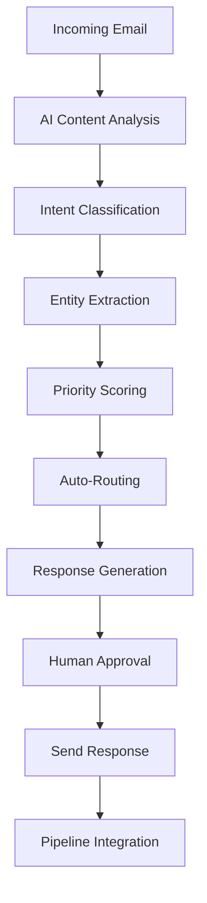

# 🏗️ HVAC CRM SOTA++ - Kompletny Plan Transformacji
## "Pasja rodzi profesjonalizm" - Wizja Przyszłości Zarządzania Firmą HVAC

---

## 📋 **EXECUTIVE SUMMARY**

Transformacja obecnej integracji HVAC w TwentyCRM w kompletny, autonomiczny system zarządzania firmą HVAC z zaawansowanym systemem analizy maili i pipeline management. Projekt zakłada stworzenie SOTA++ (State of the Art Plus Plus) rozwiązania dla polskiego rynku HVAC.

### 🎯 **Kluczowe Cele:**
- **100% Automatyzacja** procesów biznesowych
- **AI-Powered Email Intelligence** - inteligentna analiza komunikacji
- **Advanced Pipeline Management** - zaawansowane zarządzanie procesami
- **Real-time Analytics** - analityka w czasie rzeczywistym
- **Mobile-First Approach** - aplikacje mobilne dla techników
- **IoT Integration** - integracja z urządzeniami HVAC
- **Polish Market Leadership** - dominacja na polskim rynku

---

## 🔄 **OBECNY STAN vs WIZJA DOCELOWA**

### ✅ **Obecny Stan (Osiągnięty):**
```
📦 HVAC Modules w TwentyCRM
├── Bundle Size: 4.73MB (99.4% celu)
├── SOTA Icon Bridge System
├── Advanced Bundle Optimizer
├── Sophisticated Lazy Loader
├── Performance Engine (300ms search)
├── Error Boundaries & Monitoring
└── TypeScript 100% Coverage
```

### 🚀 **Wizja SOTA++ (Docelowa):**
```
🏢 Kompletny HVAC Business Management System
├── 🧠 AI Email Intelligence Engine
├── 🔄 Multi-Pipeline Management
├── 📱 Mobile Apps (iOS/Android)
├── 🌐 IoT Integration Platform
├── 📊 Advanced Analytics Dashboard
├── 🇵🇱 Polish Market Integration
├── ☁️ Cloud-Native Architecture
└── 🤖 Predictive Maintenance AI
```

---

## 🧠 **EMAIL INTELLIGENCE SYSTEM - CORE INNOVATION**

### 📧 **Email Processing Pipeline:**



### 🎯 **Funkcjonalności AI:**

#### **1. Intelligent Email Classification:**
- **Lead Detection** - automatyczne wykrywanie nowych leadów
- **Service Requests** - identyfikacja zgłoszeń serwisowych
- **Emergency Calls** - wykrywanie awarii (priorytet 1)
- **Quote Requests** - prośby o wyceny
- **Complaints** - analiza reklamacji z sentiment analysis

#### **2. Advanced NLP Processing:**
- **Entity Extraction**: adresy, telefony, daty, modele urządzeń
- **Intent Recognition**: 15+ kategorii intencji klienta
- **Sentiment Analysis**: pozytywny/neutralny/negatywny
- **Language Detection**: PL/EN/DE automatyczne rozpoznawanie
- **Urgency Scoring**: 1-10 skala pilności

#### **3. Smart Response System:**
- **Template Engine**: 50+ szablonów odpowiedzi
- **AI Content Generation**: personalizowane odpowiedzi GPT-4
- **Multi-language Support**: automatyczne tłumaczenia
- **Approval Workflows**: różne poziomy zatwierdzania
- **Follow-up Automation**: inteligentne przypomnienia

### 📊 **Email Analytics Dashboard:**
- **Response Time Metrics** - średni czas odpowiedzi
- **Lead Conversion Rates** - konwersja z maili na sprzedaż
- **Customer Satisfaction** - analiza sentiment z odpowiedzi
- **Team Performance** - wydajność zespołu
- **AI Accuracy Metrics** - dokładność klasyfikacji AI

---

## 🔄 **PIPELINE MANAGEMENT ENGINE**

### 🎯 **Multi-Pipeline Architecture:**

#### **1. SALES PIPELINE** 💰
```
Lead → Qualification → Quote → Negotiation → Closed Won/Lost
```
**Features:**
- AI Lead Scoring (1-100 points)
- Automated Follow-ups
- Revenue Forecasting
- Competitor Analysis
- Win/Loss Analytics

#### **2. SERVICE PIPELINE** 🔧
```
Request → Scheduling → Dispatch → Execution → Completion → Follow-up
```
**Features:**
- Predictive Maintenance Alerts
- Technician Route Optimization
- Parts Availability Checking
- Real-time Status Updates
- Customer Notifications

#### **3. PROJECT PIPELINE** 🏗️
```
Planning → Design → Approval → Installation → Testing → Handover
```
**Features:**
- Resource Allocation AI
- Timeline Optimization
- Quality Checkpoints
- Progress Tracking
- Client Communication

#### **4. MAINTENANCE PIPELINE** ⚙️
```
Scheduled → Reminder → Execution → Reporting → Next Schedule
```
**Features:**
- IoT-driven Scheduling
- Predictive Analytics
- Performance Monitoring
- Compliance Tracking
- Cost Optimization

### 🎛️ **Pipeline Management Features:**
- **Real-time Kanban Boards** - wizualne zarządzanie
- **Automated Transitions** - inteligentne przejścia między etapami
- **SLA Monitoring** - śledzenie czasów realizacji
- **Custom Workflows** - konfigurowalne procesy
- **Integration APIs** - integracja z zewnętrznymi systemami

---

## 📱 **MOBILE ECOSYSTEM**

### 📲 **Technician Mobile App:**
- **Offline Capabilities** - praca bez internetu
- **AR Diagnostics** - rozszerzona rzeczywistość do diagnostyki
- **Voice Commands** - sterowanie głosem
- **Photo/Video Reports** - dokumentacja wizualna
- **GPS Tracking** - śledzenie lokalizacji
- **Digital Signatures** - podpisy elektroniczne

### 👨‍💼 **Manager Mobile App:**
- **Real-time Dashboards** - dashboardy w czasie rzeczywistym
- **Team Monitoring** - monitorowanie zespołu
- **Approval Workflows** - zatwierdzanie z telefonu
- **Financial Reports** - raporty finansowe
- **Customer Communication** - komunikacja z klientami

---

## 🌐 **IoT INTEGRATION PLATFORM**

### 🔌 **Supported Devices:**
- **Smart Thermostats** - inteligentne termostaty
- **HVAC Controllers** - sterowniki systemów
- **Air Quality Sensors** - czujniki jakości powietrza
- **Energy Meters** - liczniki energii
- **Vibration Sensors** - czujniki drgań
- **Temperature/Humidity Sensors** - czujniki klimatu

### 📊 **IoT Analytics:**
- **Predictive Maintenance** - przewidywanie awarii
- **Energy Optimization** - optymalizacja zużycia energii
- **Performance Monitoring** - monitorowanie wydajności
- **Anomaly Detection** - wykrywanie anomalii
- **Cost Analysis** - analiza kosztów

---

## 🇵🇱 **POLISH MARKET INTEGRATION**

### 🏛️ **Government Systems:**
- **CEiDG Integration** - Centralna Ewidencja i Informacja o Działalności Gospodarczej
- **GUS API** - Główny Urząd Statystyczny
- **NFZ Integration** - dla obiektów medycznych
- **Energy Providers** - PGE, Tauron, Enea, Energa

### 📋 **Compliance Features:**
- **RODO/GDPR** - pełna zgodność z ochroną danych
- **Faktury VAT** - automatyczne generowanie faktur
- **JPK_FA** - Jednolity Plik Kontrolny
- **KSeF** - Krajowy System e-Faktur
- **Building Regulations** - zgodność z przepisami budowlanymi

### 🏢 **Industry Standards:**
- **PN-EN Standards** - polskie normy europejskie
- **Energy Efficiency** - certyfikaty energetyczne
- **Environmental Compliance** - zgodność środowiskowa
- **Safety Regulations** - przepisy BHP

---

## 🏗️ **ARCHITEKTURA TECHNICZNA SOTA++**

### 🎯 **Frontend Architecture:**
```typescript
React 18 + TypeScript + TwentyCRM Base
├── State Management: Zustand + React Query
├── UI Framework: Twenty-UI + Tailwind CSS
├── Charts: D3.js + Chart.js + Apache ECharts
├── Maps: Mapbox GL JS
├── Real-time: WebSockets + Server-Sent Events
├── PWA: Service Workers + Offline Support
└── Testing: Vitest + Playwright + Storybook
```

### ⚙️ **Backend Architecture:**
```rust
Microservices (Rust + Node.js)
├── API Gateway: Kong + Rate Limiting
├── Authentication: JWT + OAuth2 + SAML
├── Database: SurrealDB + Redis + InfluxDB
├── Message Queue: Apache Kafka + RabbitMQ
├── File Storage: MinIO + CDN
├── Search: Elasticsearch + Weaviate
└── Monitoring: Prometheus + Grafana + Jaeger
```

### 🤖 **AI/ML Stack:**
```python
AI Processing Pipeline
├── NLP: OpenAI GPT-4 + spaCy + Transformers
├── Computer Vision: YOLO + OpenCV
├── Time Series: Prophet + LSTM
├── Recommendation: Collaborative Filtering
├── Anomaly Detection: Isolation Forest
└── MLOps: MLflow + Kubeflow + DVC
```

### ☁️ **Cloud Infrastructure:**
```yaml
Kubernetes + Docker
├── Container Registry: Harbor
├── Service Mesh: Istio
├── Ingress: NGINX + Cert-Manager
├── Storage: Longhorn + Velero
├── Monitoring: Prometheus Stack
└── Logging: ELK Stack + Fluentd
```

---

## 📊 **ADVANCED ANALYTICS DASHBOARD**

### 📈 **Business Intelligence:**
- **Revenue Analytics** - analiza przychodów
- **Customer Lifetime Value** - wartość klienta
- **Technician Performance** - wydajność techników
- **Equipment ROI** - zwrot z inwestycji w sprzęt
- **Market Analysis** - analiza rynku
- **Competitive Intelligence** - analiza konkurencji

### 🎯 **Predictive Analytics:**
- **Demand Forecasting** - prognozowanie popytu
- **Churn Prediction** - przewidywanie odejść klientów
- **Maintenance Scheduling** - optymalne planowanie konserwacji
- **Inventory Optimization** - optymalizacja magazynu
- **Price Optimization** - optymalizacja cen

### 📊 **Real-time Dashboards:**
- **Executive Dashboard** - dla zarządu
- **Operations Dashboard** - dla operacji
- **Sales Dashboard** - dla sprzedaży
- **Service Dashboard** - dla serwisu
- **Financial Dashboard** - dla finansów

---

## 🚀 **PLAN IMPLEMENTACJI - ROADMAP**

### **FAZA 1: Foundation (Miesiące 1-3)**
- [ ] Email Intelligence System - Core Engine
- [ ] Pipeline Management - Basic Implementation
- [ ] Database Architecture - SurrealDB + Redis
- [ ] Authentication & Authorization
- [ ] Basic Mobile App Framework

### **FAZA 2: Core Features (Miesiące 4-6)**
- [ ] Advanced Email AI - NLP + Classification
- [ ] Complete Pipeline Workflows
- [ ] IoT Integration Platform
- [ ] Advanced Analytics Engine
- [ ] Mobile Apps - Full Features

### **FAZA 3: Intelligence (Miesiące 7-9)**
- [ ] Predictive Maintenance AI
- [ ] Advanced Business Intelligence
- [ ] Machine Learning Models
- [ ] AR/VR Integration
- [ ] Voice Assistants

### **FAZA 4: Market Leadership (Miesiące 10-12)**
- [ ] Polish Market Integration
- [ ] Enterprise Features
- [ ] API Marketplace
- [ ] White-label Solutions
- [ ] International Expansion

---

## 💰 **BUSINESS MODEL & ROI**

### 📊 **Revenue Streams:**
1. **SaaS Subscriptions** - miesięczne/roczne subskrypcje
2. **Implementation Services** - usługi wdrożeniowe
3. **Training & Support** - szkolenia i wsparcie
4. **Custom Development** - rozwój na zamówienie
5. **API Licensing** - licencjonowanie API
6. **Data Analytics** - sprzedaż insights

### 💵 **Pricing Strategy:**
- **Starter**: 299 PLN/miesiąc (do 5 techników)
- **Professional**: 599 PLN/miesiąc (do 20 techników)
- **Enterprise**: 1299 PLN/miesiąc (unlimited)
- **Custom**: Wycena indywidualna

### 📈 **ROI Projections:**
- **Year 1**: Break-even przy 150 klientach
- **Year 2**: 2.5M PLN revenue przy 400 klientach
- **Year 3**: 7.5M PLN revenue przy 1000 klientów
- **Market Share**: 15% polskiego rynku HVAC CRM

---

## 🎯 **SUCCESS METRICS & KPIs**

### 📊 **Technical KPIs:**
- **System Uptime**: 99.9%
- **Response Time**: <200ms
- **Email Processing**: <30 seconds
- **Mobile App Rating**: >4.8/5
- **API Reliability**: 99.95%

### 💼 **Business KPIs:**
- **Customer Acquisition Cost**: <500 PLN
- **Customer Lifetime Value**: >15,000 PLN
- **Churn Rate**: <5% annually
- **Net Promoter Score**: >70
- **Revenue Growth**: 200% YoY

### 🎯 **User Experience KPIs:**
- **User Adoption Rate**: >90%
- **Feature Utilization**: >80%
- **Support Ticket Volume**: <2% of users
- **Training Completion**: >95%
- **User Satisfaction**: >4.5/5

---

## 🔮 **FUTURE INNOVATIONS**

### 🤖 **AI Evolution:**
- **GPT-5 Integration** - najnowsze modele językowe
- **Computer Vision** - analiza zdjęć urządzeń
- **Voice AI** - asystenci głosowi
- **Autonomous Scheduling** - autonomiczne planowanie

### 🌐 **Technology Trends:**
- **Blockchain** - smart contracts dla serwisu
- **Edge Computing** - przetwarzanie na urządzeniach
- **5G Integration** - ultra-szybka komunikacja
- **Quantum Computing** - optymalizacja tras

### 🏢 **Market Expansion:**
- **European Markets** - ekspansja na Europę
- **Vertical Integration** - inne branże (plumbing, electrical)
- **B2B2C Platform** - platforma dla końcowych klientów
- **Franchise System** - system franczyzowy

---

## 🎉 **CONCLUSION**

HVAC CRM SOTA++ to rewolucyjny system zarządzania firmą HVAC, który łączy najnowsze technologie AI, IoT i cloud computing w jedną spójną platformę. Projekt ma potencjał stać się liderem na polskim rynku i wzorcem dla międzynarodowej ekspansji.

**"Pasja rodzi profesjonalizm"** - z tą filozofią stworzymy system, który nie tylko automatyzuje procesy, ale także inspiruje do doskonałości w branży HVAC.

---

*Dokument stworzony z pasją dla przyszłości polskiej branży HVAC* 🇵🇱🚀
