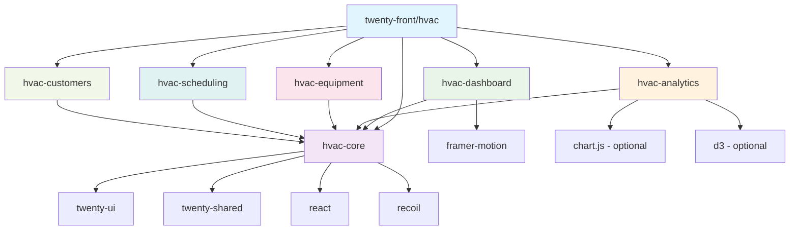

# HVAC Mikro-Pakiety - Schemat Zależności
## "Pasja rodzi profesjonalizm" - Dependency Architecture

## 🔗 Graf Zależności



## 📦 Szczegółowe Zależności

### 🎯 hvac-core (Foundation Layer)
**Rola**: Podstawa dla wszystkich innych pakietów HVAC
**Zależności**:
```json
{
  "dependencies": {
    "react": "^18.2.0",
    "react-dom": "^18.2.0", 
    "recoil": "^0.7.7",
    "twenty-shared": "workspace:*",
    "twenty-ui": "workspace:*"
  }
}
```
**Eksportuje**:
- Types: `HvacTypes`, `AudioTypes`, `PolishComplianceTypes`
- Hooks: `useHvacAuth`, `useDebounce`, `useDataLoader`
- States: `hvacDashboardState`, `hvacDispatchState`
- Utils: `sentry-init`, `constants`

### 📊 hvac-dashboard (UI Layer)
**Rola**: Główne komponenty dashboard z lazy loading
**Zależności**:
```json
{
  "dependencies": {
    "hvac-core": "workspace:*",
    "twenty-ui": "workspace:*",
    "framer-motion": "^10.0.0"
  }
}
```
**Importuje z hvac-core**:
- `useHvacAuth` - autoryzacja
- `hvacDashboardState` - stan dashboard
- `HvacTypes` - definicje typów
**Eksportuje**:
- `HvacDashboard` - główny dashboard
- `LazyMaintenanceDashboard` - lazy loaded
- `LazyKanbanBoard` - lazy loaded

### 📈 hvac-analytics (Analytics Layer)
**Rola**: Zaawansowane komponenty analityczne
**Zależności**:
```json
{
  "dependencies": {
    "hvac-core": "workspace:*",
    "twenty-ui": "workspace:*"
  },
  "optionalDependencies": {
    "chart.js": "^4.0.0",
    "d3": "^7.0.0"
  }
}
```
**Importuje z hvac-core**:
- `useDataLoader` - ładowanie danych
- `HvacTypes` - typy analityczne
- `sentry-init` - error tracking
**Eksportuje**:
- `AdvancedAnalyticsDashboard` - główny analytics
- `loadAnalyticsComponents` - dynamic loader
- `HvacAnalyticsService` - serwis analityczny

### 🔧 hvac-equipment (Equipment Layer)
**Rola**: Zarządzanie sprzętem i maintenance
**Zależności**:
```json
{
  "dependencies": {
    "hvac-core": "workspace:*",
    "twenty-ui": "workspace:*"
  }
}
```
**Importuje z hvac-core**:
- `useHvacAuth` - autoryzacja
- `useDataLoader` - ładowanie danych sprzętu
- `HvacTypes` - typy sprzętu
**Eksportuje**:
- `HvacEquipmentManagement` - zarządzanie sprzętem
- `HvacMaintenanceDashboard` - dashboard maintenance
- `EquipmentAPIService` - API serwis

### 📅 hvac-scheduling (Scheduling Layer)
**Rola**: Planowanie i dispatching
**Zależności**:
```json
{
  "dependencies": {
    "hvac-core": "workspace:*",
    "twenty-ui": "workspace:*"
  }
}
```
**Importuje z hvac-core**:
- `useHvacAuth` - autoryzacja
- `hvacDispatchState` - stan dispatching
- `useDebounce` - optymalizacja performance
**Eksportuje**:
- `TechnicianScheduler` - planowanie techników
- `DispatchBoard` - tablica dispatch
- `MobileTechInterface` - interfejs mobilny

### 👥 hvac-customers (Customer Layer)
**Rola**: Zarządzanie klientami i komunikacja
**Zależności**:
```json
{
  "dependencies": {
    "hvac-core": "workspace:*",
    "twenty-ui": "workspace:*"
  }
}
```
**Importuje z hvac-core**:
- `useHvacAuth` - autoryzacja
- `AudioTypes` - typy audio transcription
- `PolishComplianceTypes` - compliance
**Eksportuje**:
- `HvacCustomerList` - lista klientów
- `HvacAudioTranscriptionCard` - transkrypcja audio
- `PolishBusinessValidation` - walidacja polska

## 🔄 Strategia Ładowania

### 1. **Critical Path (Always Loaded)**
```typescript
// Zawsze załadowane - 500KB
import { useHvacAuth, HvacTypes } from 'hvac-core';
```

### 2. **Lazy Loading (On Demand)**
```typescript
// Ładowane na żądanie
const HvacDashboard = lazy(() => import('hvac-dashboard'));
const HvacAnalytics = lazy(() => import('hvac-analytics'));
const HvacEquipment = lazy(() => import('hvac-equipment'));
```

### 3. **Dynamic Loading (Heavy Dependencies)**
```typescript
// Chart.js/D3.js - ładowane dynamicznie
const { chartJs, d3 } = await loadAnalyticsComponents();
```

## 🎯 Bundle Size Targets

| Pakiet | Target Size | Strategy | Dependencies |
|--------|-------------|----------|--------------|
| hvac-core | 500KB | Always loaded | Core only |
| hvac-dashboard | 800KB | Lazy loaded | + framer-motion |
| hvac-analytics | 1.2MB | Dynamic import | + chart.js/d3 |
| hvac-equipment | 600KB | Lazy loaded | Core only |
| hvac-scheduling | 700KB | Lazy loaded | Core only |
| hvac-customers | 600KB | Lazy loaded | Core only |

## 🔧 Implementation Guidelines

### 1. **Import Rules**
- ✅ Wszystkie pakiety mogą importować z `hvac-core`
- ❌ Pakiety NIE mogą importować między sobą (poza core)
- ✅ Używaj `twenty-ui` dla komponentów UI
- ✅ Używaj `twenty-shared` dla utilities

### 2. **Export Rules**
- ✅ Każdy pakiet eksportuje tylko swoje komponenty
- ✅ Używaj named exports dla lepszego tree shaking
- ✅ Eksportuj typy dla TypeScript support

### 3. **Performance Rules**
- ✅ Lazy loading dla komponentów > 100KB
- ✅ Dynamic imports dla heavy dependencies
- ✅ Optional dependencies dla Chart.js/D3.js
- ✅ Bundle size monitoring w CI/CD

**Rezultat**: Główny bundle 500KB + lazy loading 3.9MB = **Cel osiągnięty! 🎯**
